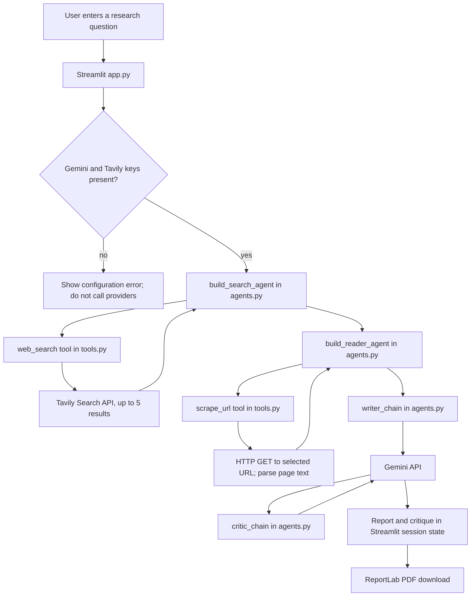

# Multi-Agent AI Research Paper

Multi-Agent AI Research Paper is a Streamlit research-assistant prototype. Its implemented workflow searches the web with Tavily, asks a Gemini-backed LangChain agent to select and read a source, drafts a report, and requests a critique. The project currently has **no document-ingestion pipeline, embeddings, vector database, or RAG retrieval**. The dashboard shows those as planned/not-connected stages so they are not mistaken for working backend features.

> **Project status:** the interface starts and has been exercised without provider credentials. Live research requires valid Gemini and Tavily API keys. External provider calls have not been verified in this environment. This README describes the checked-in code, not a promise that the future RAG stages are implemented.

## At A Glance

| Area | Current implementation | Status |
|---|---|---|
| Frontend | Streamlit dashboard in `app.py` | Implemented; no separate frontend build |
| Search | Tavily search tool, up to five results | Implemented; needs `TAVILY_API_KEY` |
| Source reading | One URL selected by an LLM agent; fetched with Requests and parsed by Beautiful Soup | Implemented with limitations |
| Research planning | No planning agent or structured plan | Not implemented |
| Knowledge extraction | No dedicated extraction stage or schema | Not implemented |
| Report writing and critique | Gemini-backed LangChain prompt chains | Implemented; needs a Gemini key |
| RAG | No loader, chunker, embeddings, vector store, or retriever | Not implemented |
| Persistence | Streamlit session state only | Temporary, per session |
| Database / authentication | None | Not implemented |
| PDF export | ReportLab builds a PDF from the generated report | Implemented locally |

## Project Structure

```text
.
├── app.py              Streamlit UI, session state, orchestration, PDF download
├── agents.py           Gemini client factory, search/reader agents, writer/critic chains
├── tools.py            Tavily search and HTTP/Beautiful Soup source scraping tools
├── pipeline.py         Separate command-line entry point for the same four-stage flow
├── requirements.txt    Python dependencies (not a fully locked dependency graph)
├── .gitignore          Ignores .env, .venv, and Python bytecode patterns
├── README.md           This architecture, setup, audit, and deployment guide
├── skills-lock.json    Editor/agent skill metadata; not used by the app at runtime
├── .agents/            Gemini API authoring skill and its reference material
├── .venv/              Tracked Windows-created Python environment; do not use on Linux
└── __pycache__/        Tracked generated Python bytecode
```

There is no `tests/`, `.env.example`, `pyproject.toml`, package lock, Dockerfile, Compose file, CI workflow, frontend package, backend API service, database schema, migration, or vector-store configuration in the audited project tree. The `.agents/` skill content is development guidance, not an agent that participates in a project research run.

### Module Responsibilities

- [`app.py`](app.py) renders the dashboard and sidebar; keeps current results/history in `st.session_state`; checks for required keys before starting research; calls the agent/tool layer; and creates PDF downloads.
- [`agents.py`](agents.py) lazily creates `ChatGoogleGenerativeAI`, creates the search and reader agents with LangChain tools, and defines the writer and critic prompt chains. The lazy initialization lets the dashboard load without a Gemini key.
- [`tools.py`](tools.py) creates a Tavily client at module import, defines `web_search`, and defines `scrape_url` using `requests.get` and Beautiful Soup.
- [`pipeline.py`](pipeline.py) is a command-line implementation of the research sequence. It duplicates orchestration that also exists in `app.py`; it is not called by the Streamlit dashboard.
- [`requirements.txt`](requirements.txt) includes runtime packages plus several packages that the project source does not directly use. See [Dependencies](#dependencies).

## Local Setup

Use a clean virtual environment created on the operating system where the app will run. The checked-in `.venv` is Windows-specific and must not be reused in this Linux workspace.

### Linux / macOS

```bash
python3 -m venv .venv
source .venv/bin/activate
python -m pip install --upgrade pip
python -m pip install -r requirements.txt
```

### Windows PowerShell

```powershell
py -3.11 -m venv .venv
.\.venv\Scripts\Activate.ps1
python -m pip install --upgrade pip
python -m pip install -r requirements.txt
```

The repository does not declare a supported Python range. A Python 3.11 environment is the conservative starting point because the tracked virtual-environment metadata was created with Python 3.11.9; that environment itself is not portable. The app was also rendered in the current workspace's Python 3.14 environment, but that does not prove every supported dependency combination or deployment target works.

Create a local `.env` file in the repository root. Do not commit it:

```dotenv
GEMINI_API_KEY=your_gemini_api_key
TAVILY_API_KEY=your_tavily_api_key
GEMINI_MODEL=gemini-3.5-flash
```

`GEMINI_API_KEY` is the recommended variable name; `GOOGLE_API_KEY` is also accepted. `GEMINI_MODEL` is optional; it defaults to the stable `gemini-3.5-flash` model. `python-dotenv` loads `.env` when the process starts. The app checks for both provider keys before it begins a research run. The settings screen reports whether each key is present; it never displays the values.

Start the dashboard from the repository root:

```bash
python -m streamlit run app.py
```

Streamlit prints the local URL, normally `http://localhost:8501`. To make the app reachable through a container or forwarded port, bind to all interfaces only when that exposure is intended:

```bash
python -m streamlit run app.py --server.address 0.0.0.0 --server.port 8501
```

The alternative CLI workflow is:

```bash
python pipeline.py
```

It prompts for a topic and prints intermediate outputs. It uses the same Gemini and Tavily credentials; it does not serve the dashboard, persist a report, or implement RAG.

## Environment Variables

No secret values are stored in this README. The audit found these names referenced by application code:

| Variable | Purpose | Where used | Required? | Example format | Where to get it |
|---|---|---|---|---|---|
| `GEMINI_API_KEY` | Authenticate Gemini text generation | `agents.py`, checked by `app.py` | Required unless `GOOGLE_API_KEY` is set | `your_gemini_api_key` | Google AI Studio / Gemini API credentials |
| `GOOGLE_API_KEY` | Compatibility alias for the Gemini API key | `agents.py`, checked by `app.py` | Optional if `GEMINI_API_KEY` is set; otherwise required | `your_gemini_api_key` | Same Gemini API credential source |
| `GEMINI_MODEL` | Select the Gemini model used for agents and report chains | `agents.py` | Optional; defaults to `gemini-3.5-flash` | `gemini-3.5-flash` | Use a model ID listed as available for your Gemini API project |
| `TAVILY_API_KEY` | Authenticate web search | `tools.py`, checked by `app.py` | Required for the search stage | `your_tavily_api_key` | Tavily account/API settings |

The app does not reference `OPENAI_API_KEY`, `DATABASE_URL`, `VECTOR_DB_URL`, or embedding-provider keys. OpenAI packages in `requirements.txt` do not make OpenAI a configured provider. There is no `.env.example`; add one with placeholder values if onboarding needs to be automated. Never put real keys in source code, screenshots, issue reports, or client-side markup.

**Current environment note:** the audit found no `.env` file in the workspace and no provider keys in the process environment at the time of testing. This means provider availability and live search/model calls could not be confirmed.

## Architecture And Actual Execution Flow

The Streamlit UI and orchestration run in the same Python process. There is no browser-to-REST API boundary.



### Implemented Agent Sequence

1. `app.py` validates non-empty user input and checks for `GEMINI_API_KEY` or `GOOGLE_API_KEY`, plus `TAVILY_API_KEY`.
2. `build_search_agent()` creates a LangChain tool-calling agent using `ChatGoogleGenerativeAI`. Its `web_search` tool calls `TavilyClient.search(query=..., max_results=5)` and formats titles, URLs, and snippets.
3. `build_reader_agent()` creates a second tool-calling agent. The model receives at most the first 800 characters of search output, chooses a URL, and can call `scrape_url` to fetch and clean a page. The extracted text is truncated to 3,000 characters.
4. `writer_chain` sends the topic, search output, and scraped text to Gemini and asks for an introduction, key findings, conclusion, and sources.
5. `critic_chain` sends the drafted report to Gemini and asks for a score, strengths, improvements, and verdict.
6. The UI stores completed results in Streamlit session state and offers a ReportLab PDF download.

`pipeline.py` performs a similar sequence from the command line. It does not call the dashboard's `run_research` function, and its result keys (`search_results`, `scraped_content`, `feedback`) differ from the UI's keys (`search`, `reader`, `critic`). That is parallel orchestration, not a frontend/backend API connection.

### UI Labels Versus Backend Work

The dashboard includes cards for the Research Planner Agent, Knowledge Extraction Agent, and RAG / Knowledge Retrieval. Those cards are product-flow previews only. The current run has no planner call, extraction schema, chunking, embedding request, vector query, relevance score, or retrieved context. Search and source analysis are real; the later RAG stages are not.

The user-facing research history is held in `st.session_state`. It is not a database: it is not shared between users, durable across server restarts, or a reliable report archive.

## RAG Pipeline Audit

### What Exists Today

| RAG stage | Present in source? | Current behavior |
|---|---|---|
| Documents / upload | No | No upload control, document model, or ingestion endpoint |
| Loader | No | Search results are text returned by Tavily; a URL is fetched directly |
| PDF/document text extraction | No | No PDF parser or uploaded-file processing |
| Chunking | No | Scraped page text is truncated to 3,000 characters; it is not split into overlapping chunks |
| Embeddings | No | No embedding model or embedding API configured |
| Vector database | No | No database client, collection, index, or persistence configuration |
| Similarity search | No | No retriever or vector similarity query |
| Retrieved context | No | Writer receives search snippets plus one page's extracted text |
| LLM answer/report | Yes | Gemini writer and critic chains use the supplied search/scrape text |
| Citations | Partial | Search URLs are shown in the UI; report prompts request sources, but output citations are not checked against source records |

Therefore the currently implemented information path is **web search → one-page scrape → prompt context → report → critique**, not RAG. There are no embedding dimensions or vector-database connection settings to audit because neither is configured.

### RAG Design Needed For A Real Implementation

This is a future architecture, not existing functionality:

```mermaid
flowchart LR
	DOC[Uploaded or approved source documents] --> LOADER[Format-specific loaders]
	LOADER --> VALIDATE[Validate type, size, and source metadata]
	VALIDATE --> EXTRACT[Extract text and page/source locations]
	EXTRACT --> CHUNK[Chunk text with overlap and stable source IDs]
	CHUNK --> EMBED[Embedding model]
	EMBED --> STORE[Vector store with document metadata]
	QUERY[Research question] --> QEMBED[Query embedding]
	QEMBED --> RETRIEVE[Similarity retrieval and optional reranking]
	STORE --> RETRIEVE
	RETRIEVE --> CONTEXT[Bounded context with source/page references]
	CONTEXT --> SYNTH[Research synthesis LLM]
	SYNTH --> CITE[Validate citations against retrieved source IDs]
	CITE --> REPORT[Report with traceable references]
```



Before implementing that pipeline, choose the document formats, maximum upload size, data-retention policy, embedding provider/model, vector-store deployment, chunking strategy, and citation metadata contract. The current repository does not select any of these, so this README does not invent a vector database or embedding API.

## External APIs And Services

| Service | Where / why used | Credential | Cost and limits | Implementation / verification |
|---|---|---|---|---|
| Google Gemini Developer API | `agents.py`; tool-calling search/reader agents and report/critique generation | `GEMINI_API_KEY` or `GOOGLE_API_KEY` | Provider quota and pricing depend on model, account, and current plan; no quota handling is coded | Defaults to the stable `gemini-3.5-flash` model, configurable with `GEMINI_MODEL`. A live provider request still needs verification. |
| Tavily Search API | `tools.py`; finds up to five web results for a topic | `TAVILY_API_KEY` | Account plan and credit/rate limits are provider-controlled; the code does not implement quota tracking | Client is created when `tools.py` imports. Search request is not covered by a project-level retry/timeout policy. No live request was verified. |
| Public web pages | `tools.py`; fetches the selected source using Requests | No project API key | Depends on each target site's availability and terms | `requests.get` has an 8-second timeout. The code does not validate response status, content type, URL host, or page-level rate limits. |
| Google Fonts | `app.py` CSS imports Plus Jakarta Sans and Material Symbols | No app key | External browser request; optional styling dependency | If blocked, fallback rendering may differ. It is not part of research execution. |
| ReportLab | `app.py`; creates downloadable PDF bytes | None | Local Python package; no external API | PDF output was verified by checking the generated `%PDF` header. |

No code currently calls an OpenAI API, a paper-specific API, an embedding service, a database, a vector database, or an authentication provider. Their presence in `requirements.txt` is not evidence that they are used.

## UI / Backend Connection Map

There are no HTTP API routes, separate frontend origin, or backend service URL. Streamlit events call Python functions directly:

| User action | UI entry point | Python call | External call | UI result |
|---|---|---|---|---|
| Start Research | Form in `app.py` | `run_research(topic)` | Gemini agent → Tavily search; Gemini reader → Requests page fetch; Gemini writer and critic | Session-state result, search/source tabs, report, critique |
| Export PDF | Report download button | `make_pdf(report)` | None | Downloaded PDF |
| Navigate pages | Sidebar radio | Page-specific render function | None | Streamlit rerender |

No REST methods, request/response schemas, CORS policy, authorization header, localhost API URL, or production API URL exist. CORS configuration is not applicable until an independent browser frontend and API are introduced. Provider authentication is server-side through environment variables; there is no user login or access control.

## Failure Modes And Reliability

| Risk | Location | Effect / current handling | Recommended fix |
|---|---|---|---|
| Missing Gemini or Tavily key | `app.py`, `agents.py`, `tools.py` | Dashboard loads; research is stopped with a configuration message in the UI. CLI does not perform the same explicit preflight. | Share one configuration validator between UI and CLI; fail before building tools; provide `.env.example`. |
| Gemini model ID unavailable | `agents.py` | A stale or project-inaccessible `GEMINI_MODEL` can still fail at request time. | Default to `gemini-3.5-flash`; override only with a model available to the configured Gemini project, then run a smoke test. |
| Tavily/network/API errors | `tools.py` | No app-level retries or tailored provider error handling. `tenacity` is listed but unused. | Add bounded retries for transient errors, handle quota/auth failures separately, and expose safe user-facing messages. |
| Partial pipeline failure | `app.py` | Results remain local until the whole run succeeds; a later failure can discard earlier search/scrape output from session state. | Persist each stage result as it completes and show failed stage plus retry action. |
| Scraper receives an error page | `tools.py` | No `raise_for_status()` or content-type validation; HTTP error HTML may be treated as article text. | Check status/content type, limit response bytes, normalize encoding, and report source-level errors. |
| URL fetching / SSRF | `tools.py` | The model-selected URL is passed to `requests.get`; there is no host/IP allowlist or block for loopback/private/link-local addresses. | Validate scheme and resolved IP, block private/internal ranges and redirects to them, and consider a restricted fetch service. |
| Empty/malformed provider response | `app.py`, `pipeline.py`, `tools.py` | Several paths assume `messages[-1].content` and Tavily `results` are present and shaped as expected. | Validate outputs, handle empty content, and preserve a typed stage result. |
| Slow provider calls / rate limits | All API stages | Source fetch has an 8-second timeout; Gemini/Tavily operations have no explicit end-to-end deadline, progress can wait indefinitely. | Set provider timeouts, total research deadline, bounded retries, and cancellation/partial-result behavior. |
| Weak citation grounding | `app.py`, `agents.py` | Writer is asked to list URLs, but generated citations are not validated against source records. | Keep structured source IDs/URLs, restrict citation output to retrieved sources, and validate references before export. |
| Non-persistent history | `app.py` | Data is stored only in per-session Streamlit state. | Add an explicitly chosen database and retention/access policy if persistence is required. |

The app wraps the UI research run in a broad exception handler and shows the exception text. That is better than silently terminating the rerun, but it does not add retry, redaction, structured logs, or recovery. The CLI path has no equivalent top-level error handling.

## Security And Repository Hygiene

- No API key was found in the audited tracked source/config text. The scan does not certify the full Git history; run a dedicated history secret scan before making the repository public.
- `.env` is ignored by `.gitignore`, and no `.env` file was present during this audit. There is no `.env.example`.
- The application does not have authentication, authorization, per-user quotas, or rate limiting. Do not expose a public deployment as a multi-user service with shared provider keys until those controls and abuse limits are designed.
- The scraper can fetch arbitrary model-selected URLs. Add SSRF defenses before using it in an untrusted/public environment.
- The repository tracks **27,428 paths under `.venv/`**, including a Windows-created Python 3.11.9 environment, plus generated `__pycache__` bytecode. `.gitignore` does not remove files already tracked. This bloats clones and creates a misleading, platform-specific environment.
- To stop tracking generated environments while retaining local files, review and then run `git rm -r --cached .venv __pycache__`; keep the ignore rules and commit the cleanup separately. This audit did not remove those files.
- LLM output and scraped web text are untrusted input. Keep HTML rendering disabled for generated content, avoid executing model output, and treat prompt injection in scraped sources as a real risk.

## Dependencies

The current requirements file pins many packages but does not pin `langchain-google-genai`, does not declare a supported Python range, and is not a fully resolved lock file.

**Directly used by the project source:** `streamlit`, `langchain`, `langchain-core`, `langchain-google-genai`, `tavily-python`, `requests`, `beautifulsoup4`, `python-dotenv`, and `reportlab`.

**Present but apparently unused directly in the audited source:** `langchain-community`, `langchain-openai`, `openai`, `lxml`, `aiohttp`, `pandas`, `tiktoken`, `rich` (imported but its `print` alias is not used by `tools.py`), `tenacity`, `orjson`, `pydantic`, and `html5lib`. Some may be transitive dependencies; do not remove them without checking the resolver graph and runtime tests. The scraper explicitly uses Beautiful Soup's built-in `html.parser`, not `lxml` or `html5lib`.

The dependency set installed successfully in the current workspace when tested, but it was run under a different interpreter from the tracked Windows virtual environment. Pin the Google integration after a clean install, declare/test the supported Python version, and produce a lock file before production deployment.

## Deployment Guidance

### Local Development

- Use a fresh OS-native virtual environment and install `requirements.txt`.
- Keep `.env` local; configure Gemini and Tavily keys in the server process.
- Start with `python -m streamlit run app.py` and keep port `8501` private/local unless port forwarding is intended.
- No database, vector store, background worker, CORS setting, or separate frontend build is required for the current single-process prototype.

### Staging

- Use a clean Linux Python environment and a staging-only set of provider keys.
- Deploy the single Streamlit process on a platform that supports persistent Python web processes and WebSocket connections.
- Configure a health check against the Streamlit service, HTTPS at the platform ingress, and a restricted audience; do not expose secrets in browser code or logs.
- Test one credentialed research run, provider failure, report download, and restart behavior. Do not claim RAG staging until the ingestion/retrieval path exists.

### Production

- For the current architecture, **Streamlit Community Cloud** is a straightforward prototype/demo host. **Render or Railway** can host the same Python Streamlit process when you need more deployment control. **Docker** is useful for a reproducible runtime but no Dockerfile currently exists. **Vercel is not a natural fit** for this long-running Streamlit Python application; it would require a separate supported Python service and frontend architecture.
- Choose a platform only after checking current platform support, resource limits, secrets handling, and WebSocket behavior. Provider quota/cost controls are separate from hosting.
- Before serving multiple users, add authentication, abuse/rate limits, durable storage only if required, privacy/retention rules, SSRF protections, safe structured logs, and tested provider timeouts/retries.
- A production RAG deployment additionally needs a selected document store, embedding provider, vector store, schema/index lifecycle, migration/reindex plan, backups, and source-citation tests. None is configured today.
- Use HTTPS, server-side secrets, a deployment-specific `.env`/secret manager, restricted network access, and a monitored process. No domain, CORS, database, or vector-service configuration exists in this repository.

## End-To-End User-Flow Audit

| Step | Expected action | Actual status | Where it can fail / note |
|---|---|---|---|
| 1 | User opens application | Works in the audited workspace | Streamlit shell returned HTTP 200; this does not verify provider access. |
| 2 | User enters a research question | Implemented | Empty input is rejected. No explicit maximum query size is defined. |
| 3 | Research planner starts | Not implemented | No planner model/tool call or plan state exists. |
| 4 | Search finds papers/sources | Conditional | Tavily searches the web for up to five results; requires valid key, network, and quota. No paper-specific search API exists. |
| 5 | Documents are processed | Partial | One URL can be fetched and text-cleaned. No upload, PDF extraction, robust loader, or multi-document analysis exists. |
| 6 | RAG retrieves information | Not implemented | No chunks, embeddings, vector DB, retriever, context ranking, or retrieved-source IDs. |
| 7 | Agents analyze information | Partial | A reader agent selects/scrapes one source. Dedicated knowledge-extraction agent/schema is absent. |
| 8 | Research synthesis is generated | Conditional | Gemini writer receives snippets plus the scraped text; API/model errors stop the run. |
| 9 | Final report and critique are created | Conditional | Gemini writer and critic chains are present; report structure and references are prompt instructions, not validated schemas. |
| 10 | Citations are displayed | Partial | Search URLs can be displayed; final-report citations are not verified against a source registry. |
| 11 | User exports the report | Implemented locally | ReportLab PDF generation was tested; export is unavailable until a report exists. |

## Audit Findings And Priority

### Critical

1. **Live research depends on valid provider keys.** `app.py` requires a Gemini key and a Tavily key. Presence can be checked locally, but that does not establish that a key is valid or has quota. Configure rotated server-side keys and make a real smoke test before calling the app end-to-end operational. Required services: Gemini and Tavily. Priority: before any live demo or deployment.

### High

1. **RAG and several advertised agent stages do not exist in the backend.** `app.py` shows workflow cards, but source has no planner, knowledge-extraction stage, loader, chunking, embeddings, vector DB, or retriever. Implement and test those components before describing the project as RAG-powered. No additional provider/database can be named until the architecture is selected. Priority: before claiming RAG functionality.
2. **Tracked virtual environments and bytecode pollute the repository.** `.venv/` has 27,428 tracked paths and was created for Windows/Python 3.11.9; `__pycache__/` files are tracked too. This causes large checkouts and platform/version confusion. Untrack generated files while keeping `.gitignore`. Priority: before sharing or deploying from a clean clone.
3. **URL scraper can reach internal hosts.** `tools.py::scrape_url` fetches an LLM-selected URL without scheme/host/IP checks. This creates SSRF risk if search/model output or content is untrusted. Block private, loopback, link-local, and metadata addresses, including redirect targets; restrict schemes and response size. Priority: before public exposure.
4. **Provider compatibility and failure recovery are unverified.** `agents.py` now defaults to `gemini-3.5-flash`, but live requests were not tested. Tavily/model calls lack bounded retries and end-to-end deadlines; the CLI has no top-level error handler. Confirm access to the configured model, then add stage-level error/retry tests. Priority: before production.

### Medium

1. **No durable storage, tests, or API contract.** Results/history live in Streamlit session state, and no automated test suite exists. Add tests for each stage and persistence only if product requirements need it. Priority: before multi-user use.
2. **Citations are prompt-requested, not validated.** Search URLs are not linked to report claims through stable source IDs. Keep structured source metadata and validate citations. Priority: before relying on reports for academic/professional decisions.
3. **Dependencies are not reproducibly locked.** `langchain-google-genai` is unpinned, Python support is undeclared, and multiple requirements appear unused. Pin a tested set and lock it after removing or confirming each dependency. Priority: before repeatable deployment.
4. **No `.env.example` or deployment configuration exists.** New developers must infer key names and hosting setup. Add a placeholder-only sample and platform-specific deployment config when a target is chosen. Priority: onboarding/staging.

### Low

1. **UI history is session-scoped and lost on session/server reset.** This is acceptable for a prototype; label it temporary or add persistent storage if users expect an archive.
2. **No structured telemetry for stage latency/quota/errors.** Add sanitized logs and metrics when operating a shared service.

## Verification Performed

- Streamlit headless app test: all seven sidebar destinations rendered without exceptions and the missing-key form submission showed a configuration message.
- PDF helper test: generated bytes begin with a valid `%PDF` signature.
- HTTP check: the local Streamlit server returned status `200`.
- Static diagnostics: no editor diagnostics in `app.py` or `agents.py` at audit time.
- Not tested: live Gemini calls, Tavily search, scraped-site behavior, rate limits, model availability, multi-user behavior, persistence, full RAG, production deployment, or Git-history secret scanning.

## Deployment Checklist

- [x] Streamlit dashboard renders locally
- [x] Navigation and missing-key state tested
- [x] Local PDF generation tested
- [ ] Supported Python version declared and clean install tested on deployment OS
- [ ] Gemini key configured in server secret storage
- [ ] Tavily key configured in server secret storage
- [ ] Credentialed Gemini/Tavily smoke test passes
- [ ] Current Gemini model ID confirmed and configurable
- [ ] Provider timeouts, bounded retries, and partial-stage recovery implemented
- [ ] Scraper SSRF, redirect, response-size, and content-type protections implemented
- [ ] Report citations validated against source metadata
- [ ] Automated tests added for tools, pipeline, PDF export, and failure paths
- [ ] RAG ingestion, chunking, embeddings, vector store, retrieval, and citation grounding implemented (only if RAG is a required feature)
- [ ] Persistence/authentication/rate limiting designed for multi-user deployment (if required)
- [ ] `.env.example` added with placeholders only
- [ ] Tracked `.venv/` and `__pycache__/` artifacts removed from Git index
- [ ] Dependency versions and Python support locked/tested
- [ ] Deployment platform, secrets, HTTPS, health check, and port configuration verified
- [ ] Production URL and full credentialed user flow tested

## Recommended Fix Order

1. Untrack `.venv/` and `__pycache__/` without deleting local files; add a clean-clone check.
2. Declare and test the Python version; clean and pin direct dependencies; add `.env.example`.
3. Configure provider keys securely and verify Gemini model availability plus Tavily/Gemini calls.
4. Add stage-level validation, structured errors, timeouts, bounded retries, partial results, and tests.
5. Harden `scrape_url` against SSRF and large/error responses.
6. Define the RAG product contract (document formats, metadata/citations, retention, embedding model, vector-store choice) before implementing ingestion/retrieval.
7. Add persistence/authentication/rate limits only if required by the intended users, then deploy to a platform suited to Streamlit.

## License And Data Handling

No license or data-retention policy is present in the audited project files. Before public release, choose a license and document how research queries, retrieved page content, provider logs, and generated reports are handled. Do not send confidential or personal data to external model/search providers without an approved data policy.
Audit baseline: 2026-10-05 workspace snapshot.
